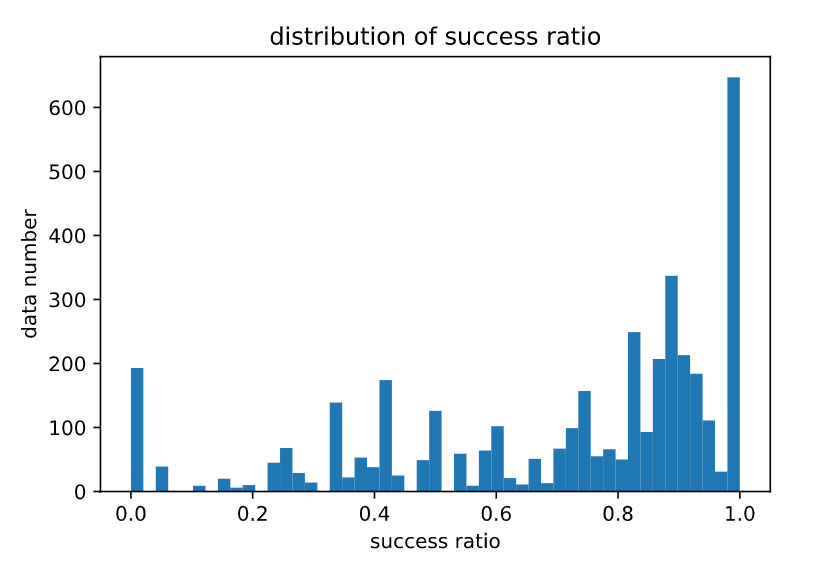
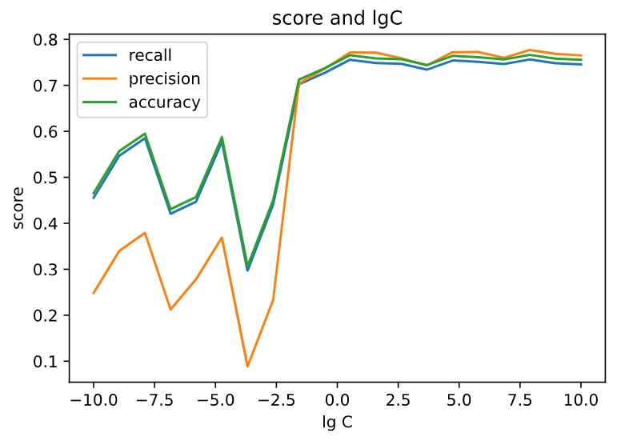
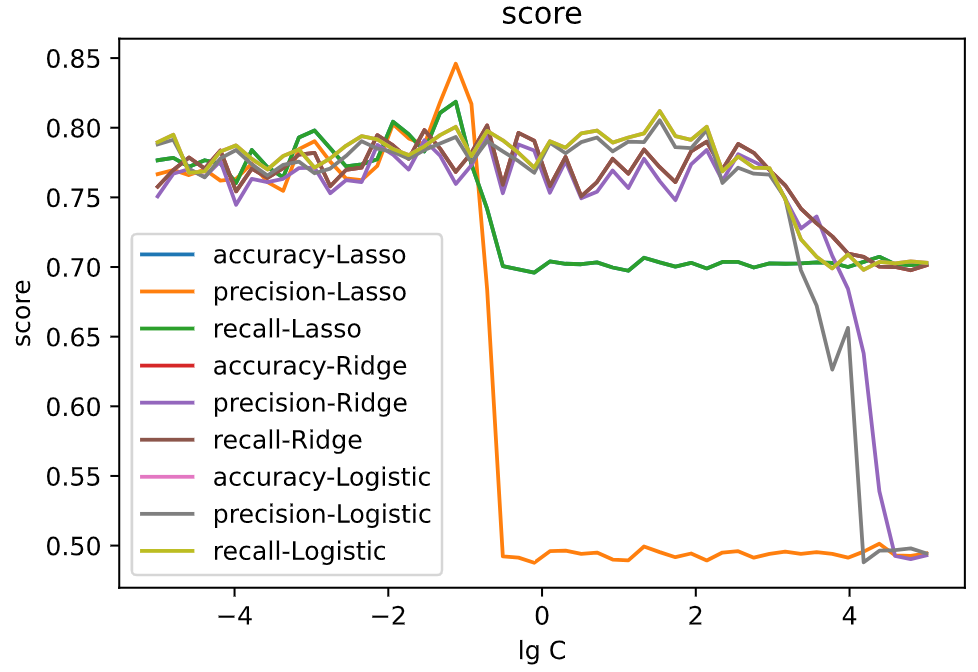
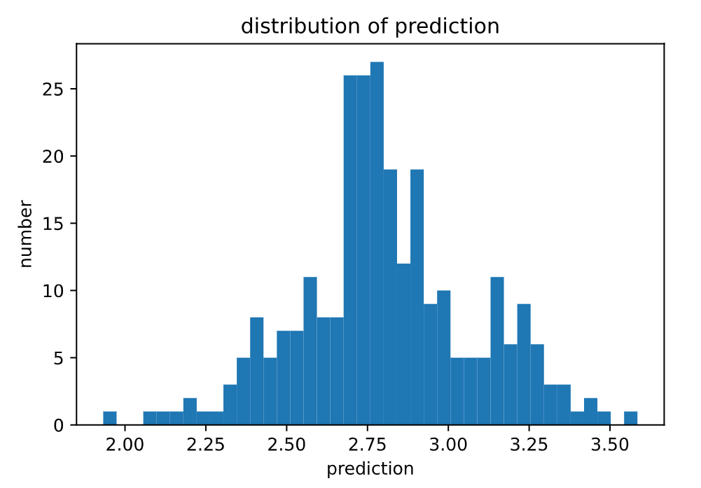
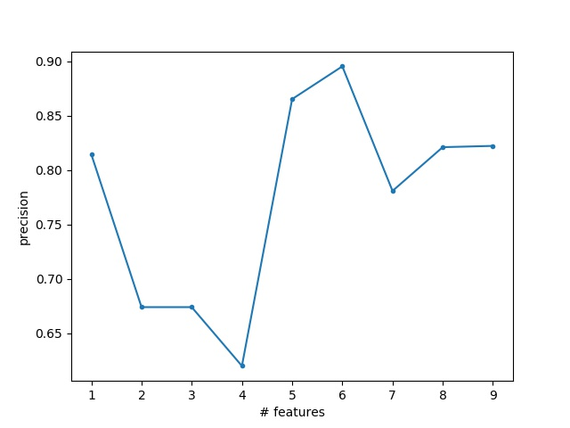

# 参考文献的分析

作者从实验室笔记本中收集了水热合成反应的信息，并使用商业软件添加了使用反应物名称计算得到的物理化学性质（比如有机反应物的配体分子量，氢键给体受体数，极性表面积，无机反应物的电离能，电子亲合能，电负性，硬度，原子半径，元素周期表中的位置)。数据的标签取值为1，2，3，4从小到大代表结晶结果从坏到好。以反应产生单晶或多晶为成功（3，4），反之为失败。

以此训练机器学习模型来预测新反应的结果。虽然训练时的标签分为4类，但是评估模型时将分类结果化为成功与失败。


使用支持向量机（Pearson VII核）用来预测新的反应精度为89%，超过了人类直觉（精度为78%）。

由于支持向量机不具有可解释性，将其预测结果用决策树模型拟合，得到了反应成功需要的条件。

亮点在于利用了一直被忽视的失败数据。但是研究方法并不先进，使用了最简单的支持向量机模型并且没有对参数比如软间隔大小，核函数的影响进行分析，也没有进行类别平衡。用分类树得到了化学直觉。

问题：70%的成功率如何能称为失败反应。

测试集上89%的成功率究竟是如何计算的，我们自行计算的结果只有81%。

为何不直接用分类树拟合实验结果而是拟合SVM的结果。

可以用委员会给出成功的概率，并进行探索与利用的平衡，而不是像文献中的利用新反应物与已有反应物的相似程度来探索。

数据集的划分可能存在问题，文献中的训练集所包含的负样本和测试集所包含的负样本具有非常不同的性质，以至于适应了训练集的模型对测试集的负样本描述或者很差（不平衡数据集）或者严重干扰了正样本的识别（平衡数据集）。（Re：负样本“Dark reaction”不够多？）

特征选择在不同的特征选择方法之间并不具有好的一致性，这一点让我们对于文中提出的“化学直觉”这件事情持保留态度。如果真的是足以让人能够总结和归纳规律从而进一步探索其机理和本质的“化学直觉”所对应的特征，应当和结果具有相当的、鲜明的相关性，为何挑选出来的特征甚至不能够训练出一棵差强人意的决策树？

进一步地，就从我们的化学直觉上讲，MOF的结构显然不是唯一的，而对于不同的MOF结构，却希望用一个普遍的、只依赖于数个十分简单的参量的模型就能够预测特定的反应物组合能否形成MOF，这相当于优化一个本身就有很多个稳定解的问题，单个决策树似乎并不很擅长这一点，而当前的数据集似乎还不能充分的反映这样多个稳定区域的特性（主要在于周边的不稳定区域行为），导致了神经网络不容易找出正确的规律。

如果作者先考虑对MOF根据结构特征以及一些底物组合特征进行聚类，再对各个类各自进行这样的处理，结果是否会更好，而分析结果得到的规律是否能够给出更加清晰的化学图像？

# 数据处理与分析

作者开放了使用的数据，并且已经划分成了训练集[train.csv][./data/train.csv]与测试集[test.csv][./data/test.csv]。每个数据有264维。有标签，值为1，2，3，4从低到高代表结晶情况从好到坏。

其中有32个feature取值为"Yes","No"，分别用数值1,0。其中一些feature中含有"?"表示参数不明，使用"?"为"Yes"的先验概率表示。
$$
\frac{\text{这一feature中Yes的数量}}{\text{Yes的数量+No的数量}}
$$
有6个feature取值为代表反应物名称的字符串，转换为独热编码。

其余feature取值为数值，不需要特殊处理。

由于数据大部分的feature都是直接由理论计算得到，不应当存在需要处理的异常值，因此不进行异常值的检测。事实上使用$z=\frac{z-\mu}{\sigma}$标准化后以$|z|<3$判定是否出现异常值，发现几乎所有特征都出现了异常值。数据本身不是正态分布，更接近于poisson分布，不应当因为偏离平均值过多而舍去。

作者希望发现新的反应物，因此要求划分测试集时将同一反应物组合的反应全部放在测试集或者训练集。因此我们按照反应物组合将训练集数据分组。从中训练集划分出验证集时随机抽取反应物组合，再得到相应的数据。

结果保存在[Xx.npy][./processedData/Xx.npy]，[Y.npy][./processedData/Y.npy], [y.npy][./processedData/y.npy]

作者将标签为1，2的反应条件视作失败反应，标签为3，4视为成功反应。由此对训练集的标签比例作图。


可以看出，大部分反应成功，类别明显不均衡。

而测试集的数据更不均衡


对不同反应物类型的反应分组，得到每组中反应个数的分布如下。最大的一组由175个反应，绝大多数反应物组合的反应数目在20以下。


为了考察反应物类型对反应结果的影响，对每个反应物组合，所有反应中成功反应的比例。发现反应物名称对反应结果有重大影响。但是作者的意图是发现新反应，因此将反应物名称从特征中剔除。



# 模型选择

作者使用3折交叉验证进行模型选择，我们也同样使用。

作者使用了SVM，核函数为Pearson VII。我们使用sklearn中的SVC进行了复现。并对数据进行标准化
$$
z=\frac{x-\mu}{\sigma}
$$
类别不均衡问题可以直接使用SVC的class_weight="balanced"解决。

作者在测试集上的结果为

混淆矩阵

|              | prediction 1 | prediction 0 |
| ------------ | ------------ | ------------ |
| true label 1 | 212          | 13           |
| true label 0 | 48           | 3            |

accuracy=81%

precision=81%

recall=93%

使用作者使用的Pearson VII核函数，对不同的正则化强度（控制软间隔大小）进行实验，交叉验证的结果如下。



设C=10，得到支持向量机模型应用于测试集上，发现效果极差，混淆矩阵为

|              | prediction 1 | prediction 0 |
| ------------ | ------------ | ------------ |
| true label 1 | 225          | 0            |
| true label 0 | 51           | 0            |

accuracy =81%

precision=81%

recall=100%

但是这个模型是全然无用的，无法预测0。

这一模型在训练集上给出结果的混淆矩阵为

|              | prediction 1 | prediction 0 |
| ------------ | ------------ | ------------ |
| true label 1 | 2778         | 0            |
| true label 0 | 21           | 1173         |

并且尝试增大正则化强度（减小C）也不能提高0的特异性。

这说明测试集与训练集的数据分布显著不同。

使用其他核函数：

rbf核，3折交叉验证结果如下，recall与另外两条曲线重合。


使用C=100，得到的模型性能如下

|              | prediction 1 | prediction 0 |
| ------------ | ------------ | ------------ |
| true label 1 | 116          | 109          |
| true label 0 | 20           | 31           |

accuracy =53%

precision=85%

recall=51%

虽然这一模型的recall很低，但是precision非常高。由于实验代价比理论代价高，因此precision更为重要。

而使用sigmoid核，CV性能较差且不稳定。


在测试过程中，我们发现了有趣的事实：直接使用successful/failed进行训练得到的CV值比使用1，2，3，4训练效果差。


但是更有趣的是在使用0，1作为标签后rbf核虽然CV值下降了，但是在测试集上的效果更好了。

|              | prediction 1 | prediction 0 |
| ------------ | ------------ | ------------ |
| true label 1 | 167          | 58           |
| true label 0 | 16           | 35           |

accuracy =73%

precision=91%

recall=74%

而Pearson VII核性能没有提升。这一问题可能还是因为测试集的分布不同于训练集。

我们进一步想到，1，2，3，4这四个类别是有序的，而svm的one vs rest方法并不能利用这一有序性。因此我们改为直接拟合label，而不是分类。

我们采用线性模型：使用自带的normalize参数进行参数标准化，不考虑类别均衡问题。以2.5为阈值，如果预测值高于阈值则视为成功反应，反之视为失败反应。简单的线性拟合取得了良好的效果。

|              | prediction 1 | prediction 0 |
| ------------ | ------------ | ------------ |
| true label 1 | 188          | 37           |
| true label 0 | 44           | 7            |

accuracy =70%

precision=81%

recall=83%

考虑到有大量特征，因此进行了正则化，尝试了Lasso回归，Ridge回归，Logistic回归。三折交叉验证计算不同正则化强度下的得分，但是性能提升不大。



尝试通过斜率的大小判定一个参数,但是观察到Lasso回归性能在正则化强度很高时性能下降，说明将斜率小的因素忽略会引发问题。

使用性能最高C=0.1的Lasso回归对测试集进行预测。

|              | prediction 1 | prediction 0 |
| ------------ | ------------ | ------------ |
| true label 1 | 196          | 29           |
| true label 0 | 46           | 5            |

accuracy =72%

precision=81%

recall=87%

与简单的线性回归差别不大

尝试调整阈值，作出预测值分布的直方图



阈值可以在2.25到3.00之间调节，由于我们在意的是precision，因此不做出ROC曲线而是作出precision随阈值变化的曲线。

出人意料的是阈值越大测试集上的precision越低，但是在验证集上没有这个问题。


文献中所用的特征选择方法sklearn没有实现，此处使用了sklearn中实现的另外两种特征选择方法：SelectKBest和RFE(recursive feature elimination)，希望对作者的结果得到某种交叉验证。

选择出来的特征和作者不尽相同，出现了文中没有提到的特征（比如'Na'/'K'/‘XXXinorg2mass’），同时更多的反应条件相关的特征被选择（尤其是‘pH’/‘purity’在两种方法的结果中都出现了，这两个看上去倒还算是靠谱）。

SelectKBest并没有选择有机物的结构描述符，且用保留不同数目特征训练的决策树的预测结果精度变化趋势也不是单调的。用SelectKBest选择出来的结果训练的决策树表现并不尽人意。变化趋势以及决策树展示如下：




而RFE给出了更加离谱的结果（只给出了两个负的结果，其中一个还是错的）。尽管如此，由于测试集的巨大不平衡，结果的precision、recall、accuracy看上去都非常好。作者所给出的“an accuracy of 70.7% (best-first) and 71.6% (greedy stepwise)”是否其实也是这样的结果？

我们试图训练一个小的神经网络（两层，每层8个神经元）作为分类器来从另一个角度重复上述工作。

可能是由于这个数据集的特征并不是十分明显，神经网络收敛很困难，且对于稍大的batch size（32）就基本不收敛。

在只使用作者给出的性质描述符的情况下，当不考虑训练集上的数据不平衡时（正样本数目大约是负样本数目的两倍），神经网络还算是能够比较好的识别出正样本（训练集上对正样本的recall达到0.945，测试集上为0.627），但很难识别出负样本（对负样本的recall在训练集上为0.303，测试集上0.098）。

很有意思的是，当使用调整抽样权重的方法平衡数据不平衡问题的时候，神经网络在测试集上达到对正负样本的recall分别为0.654/0.722（此时结果已经不再随着epoches增加），但在测试集上对正负样本的recall分别只有0.191和0.529. 负样本严重干扰了正样本的识别。

# 代码结构

**processData.py* 数据处理的代码。这一部分的代码虽然很短，但为了处理源数据中的各种情况而没有包装，并且使用错误处理代替正常而复杂的条件判断。处理完后保存处理好的数据于./processedData。

为了简便地调用处理好的数据，以及一些通用的函数，将它们放在utils.py中。作者使用的策略是让模型产生将数据分为1，2，3，4四类，而评价模型时将1，2视作0，3，4视作1，计算精度。因此设计numout2boolout函数。
```{python}
def numout2boolout(label):
    return label > 2.5
```
可以利用广播机制对向量进行处理，还可以转化线性回归模型的输出。

作者使用的训练集验证集划分要求同一反应组合的分在同一个集合中，因此我们不使用sklearn提供的CV函数，而是先对把反应物组合划分为测试集验证集再把组合中的数据放入测试集验证集中。

```{python}
def CV_author(X, Y, n_splits, Model, params, scale=True, shuffle=True):
    if scale:
        X = StandardScaler().fit_transform(X)  # 标准化数据
    kf = KFold(n_splits=n_splits, shuffle=shuffle)  # 随机划分训练集与测试集中的反应组合

    for train_index_rc, test_index_rc in kf.split(reactantCombination):
        train_index = [
            i for rc in train_index_rc for i in reactantCombination[rc]]
        test_index = [
            i for rc in test_index_rc for i in reactantCombination[rc]]
        X_train, X_test = X[train_index], X[test_index]
        Y_train, Y_test = Y[train_index], Y[test_index]
        model = Model(**params)
        model.fit(X_train, Y_train)
        pred = model.predict(X_test)
        Y_test = numout2boolout(Y_test)
        pred = numout2boolout(pred)
        print("recall={:.3f}".format(
            recall_score(Y_test, pred, average='weighted')))
        print("precision={:.3f}".format(
            precision_score(Y_test, pred, average="weighted")))
        print("accuracy={:.3f}".format(accuracy_score(Y_test, pred)))
        print("confusion matrix is")
        print(confusion_matrix(Y_test, pred))
```

PUK_kernel是作者使用的SVM核函数，参考了以下项目:https://github.com/rlphilli/sklearn-PUK-kernel

test函数求模型在预测集上的表现，类似CV_author。

**SVC.py** 使用交叉验证方法测试不同核函数以及不同正则化强度的效果。

**Linear_fit.py** 通过交叉验证方法检验不同正则化强度的线性回归方法的效果将输出重定向到了./out/Ridge.out, ./out/Lasso.out, ./out/Logistic.out

由于对得到的数据进行作图与分析的过程比较灵活，因此使用jupyter notebook。

**dataAnal.ipynb** 对得到的数据的分布进行分析。

**outAnal.ipynb** 对模型的输出进行分析。

**feature_select.py** 进行特征选择并利用选择后的特征训练决策树。

**NN.py** 搭建了一个两层的神经网络分类器并进行训练。

# 每个人的工作
王希元：原始数据处理与